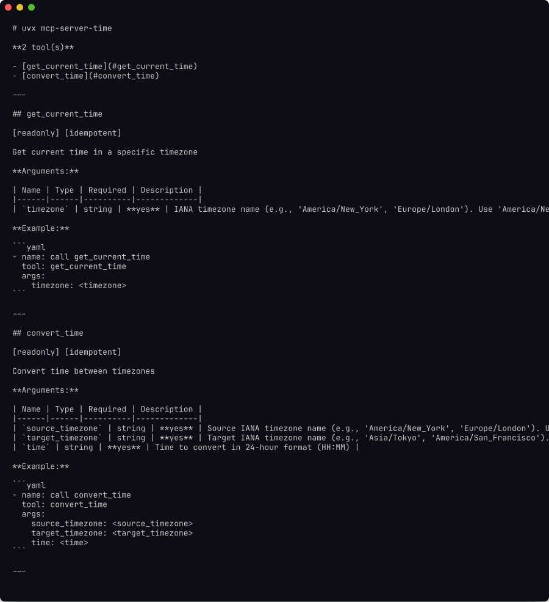
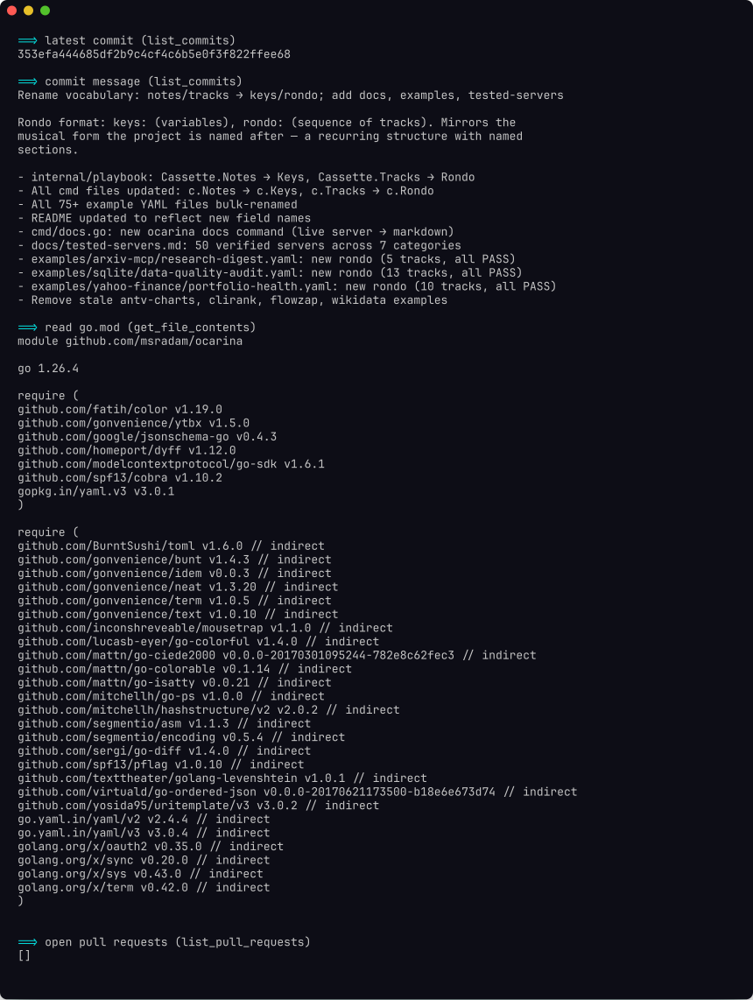

<div align="center">
  <picture>
    <source media="(prefers-color-scheme: dark)" srcset="assets/whistle-dark.svg">
    
  </picture>
  <h1>Ocarina</h1>
</div>

Ocarina is a YAML automation framework for [MCP](https://modelcontextprotocol.io) servers. Write a declarative script that calls MCP tools in sequence, asserts on results, and pipes values between steps. No LLM involved.





## Design principles

- **Deterministic.** The same rondo produces the same result on every run. No sampling, no randomness.
- **Protocol-native.** Talks MCP directly via `tools/call`, `resources/read`, and `resources/list`. Works with any compliant server.
- **Assertions are first-class.** `play` exits non-zero if any `expect:` check fails. Rondos work as CI health checks out of the box.
- **No credentials in scripts.** Server connection and environment variables stay outside the rondo file.
- **One rondo, any machine.** If the MCP server is available, the rondo runs.

## Install

```bash
go install github.com/msradam/ocarina@latest
```

Binaries are available on the [releases page](https://github.com/msradam/ocarina/releases). Requires Go 1.22+.

## Use

Generate markdown docs for a server:

```bash
ocarina docs uvx mcp-server-sqlite --db-path mydb.sqlite
ocarina docs npx -y @modelcontextprotocol/server-github > docs/github.md
```

Run a rondo:

```bash
ocarina play db-audit.yaml
ocarina play db-audit.yaml --dry-run
ocarina play db-audit.yaml -e db=/tmp/other.sqlite  # override a key at runtime
```

Validate a rondo against the live server without running any tools:

```bash
ocarina validate db-audit.yaml
```

## Rondo format

A rondo is a YAML file with three sections.

```yaml
keys:
  owner: acme
  repo: api

server:
  command: npx
  args: [-y, "@modelcontextprotocol/server-github"]

rondo:
  - name: recent commits
    tool: list_commits
    args:
      owner: "{{owner}}"
      repo: "{{repo}}"
    grab: ".0.sha"
    echo: latest_sha

  - name: commit detail
    tool: get_commit
    args:
      owner: "{{owner}}"
      repo: "{{repo}}"
      sha: "{{latest_sha}}"
    expect:
      contains: "feat"
```

### Step fields

| Field | Description |
|---|---|
| `tool` | Tool name to call |
| `resource` | Resource URI to read (`resources/read`) |
| `list_resources` | Server prefix to list resources from; output is a JSON URI array |
| `args` | Tool arguments. `{{key}}` interpolates from `keys` or prior `echo` captures |
| `echo` | Store this step's output under a key for later steps |
| `grab` | Dot-path into JSON output before storing: `.0.sha`, `.name`, `.items.0.id` |
| `loop` | Expand a JSON array key into repeated iterations; sets `{{item}}` each time |
| `expect.contains` | Assert output contains this string |
| `expect.matches` | Assert output matches this regex |
| `expect.equals` | Assert output equals this string (whitespace-trimmed) |
| `expect.is_error` | Assert whether the tool returned `isError: true` |
| `ignore_errors` | Continue past failures instead of halting |
| `tags` | Tag this step for `--tags` / `--skip-tags` filtering |

`{{env.NAME}}` resolves from the process environment and works anywhere `{{key}}` does.

## Commands

**`ocarina docs <command> [args...]`**: generate markdown documentation for every tool, resource, and resource template a server exposes.

**`ocarina play <rondo.yaml>`**: execute each step against the live server.

**`ocarina validate <rondo.yaml>`**: check tool names, required args, schema types, and `{{key}}` data flow without making any calls.

**`ocarina hum <command> [args...] -- <tool> [key=value ...]`**: call a single tool and print the result.

**`ocarina record <output.yaml> <command> [args...]`**: proxy mode; records every tool call from a live MCP client session into a rondo file.

## Server names

Create a `.mcp.json` (or `~/.mcp.json` for credentials) and reference servers by name in rondos and on the command line:

```json
{
  "mcpServers": {
    "github": {
      "command": "npx",
      "args": ["-y", "@modelcontextprotocol/server-github"],
      "env": { "GITHUB_PERSONAL_ACCESS_TOKEN": "ghp_..." }
    }
  }
}
```

```yaml
server: github
```

```bash
ocarina hum github -- list_commits owner=pytorch repo=pytorch per_page=1
```

See `mcp.json.example` for a starter template. Ocarina also discovers servers from the Claude Desktop config (`~/Library/Application Support/Claude/claude_desktop_config.json`).

## Examples

Working rondos for 50+ MCP servers are in [`examples/`](examples/). A selection:

| Rondo | Server | What it does |
|---|---|---|
| `sqlite/data-quality-audit.yaml` | `mcp-server-sqlite` | Schema check, row counts, referential integrity assertions |
| `github-investigation/repo-health.yaml` | `github-mcp-server` | Commit history, open issues, contributor activity |
| `github-investigation/resource-audit.yaml` | `github-mcp-server` | Read repo files directly via `resource:` steps |
| `postgres/query-workflow.yaml` | `mcp-server-postgres` | Multi-step query and result validation |
| `docker/docker.yaml` | `mcp-server-docker` | Container list, image audit, resource usage check |
| `elasticsearch/cluster-search.yaml` | `mcp-server-elasticsearch` | Index health, search, document count assertions |
| `playwright-browser/page-audit.yaml` | `mcp-server-playwright` | Navigate, extract content, assert on page state |
| `yahoo-finance/portfolio-health.yaml` | `mcp-yahoo-finance` | Price fetch, income statements, parameterized by ticker |

See [docs/tested-servers.md](docs/tested-servers.md) for the full list.

## Use in CI

`play` exits 0 if all `expect:` assertions pass, non-zero otherwise. Drop a rondo into any CI pipeline:

```yaml
- name: Database health check
  run: ocarina play rondos/db-audit.yaml
```

## License

MIT. [Whistle](https://thenounproject.com/browse/icons/term/whistle/) icon by Alessio Capponi from [Noun Project](https://thenounproject.com) (CC BY 3.0).
